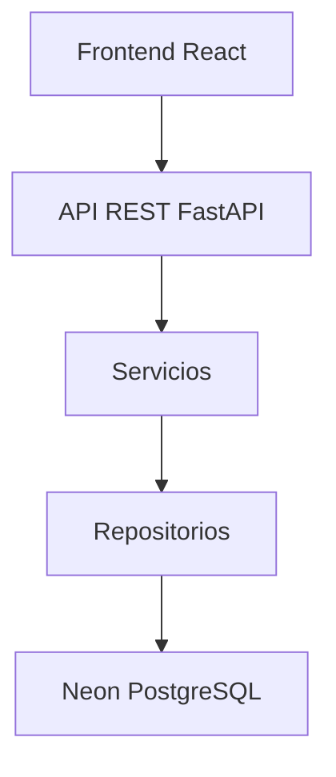

# Arquitectura Tecnica

## Stack oficial

### Frontend

- React.
- TypeScript.
- Vite.
- TailwindCSS.
- React Router.
- Axios.
- React Query.
- Zod.
- React Hook Form.

### Backend

- Python 3.12.
- FastAPI.
- SQLAlchemy 2.
- Alembic.
- Pydantic.
- Passlib.
- Python-Jose.

### Base de datos

- Neon PostgreSQL.

### Infraestructura

- GitHub.
- Vercel para despliegue de la aplicacion.
- Neon para base de datos.
- Cloudinary para almacenamiento y optimizacion de imagenes.

Decision actual del usuario:

- Se desea desplegar en Vercel.
- El sistema usara TypeScript, JavaScript, CSS, Python y Neon segun el stack definido.
- El backend FastAPI se desplegara en Vercel mediante funciones Python compatibles con ASGI.
- La arquitectura sera serverless.
- Las imagenes de productos se almacenaran en Cloudinary usando su plan gratuito.
- No existe base de datos Neon creada.
- No existe repositorio GitHub creado.
- La URL final aun no esta definida.

Reglas tecnicas confirmadas:

- El backend se desarrollara en Python con FastAPI.
- El frontend se desarrollara con React, TypeScript, JavaScript y CSS.
- La base de datos sera Neon PostgreSQL.
- El backend sera responsable de cargar imagenes a Cloudinary.
- No se administraran servidores propios.
- El despliegue debe mantenerse sencillo, escalable y de bajo mantenimiento.

## Flujo arquitectonico



## Capas del backend

```text
backend/
  app/
    api/
    core/
    config/
    database/
    models/
    schemas/
    repositories/
    services/
    middlewares/
    security/
    utils/
  tests/
```

Responsabilidades:

- `api`: rutas HTTP y controladores.
- `schemas`: DTOs de entrada y salida con Pydantic.
- `services`: reglas de negocio y transacciones.
- `repositories`: acceso a datos.
- `models`: modelos SQLAlchemy.
- `security`: JWT, hashing y dependencias de autenticacion.
- `middlewares`: seguridad, trazabilidad, rate limiting y logs.
- `database`: conexion, sesiones y migraciones.
- `config`: configuracion por variables de entorno.

## Estructura del frontend

```text
frontend/
  src/
    components/
    layouts/
    pages/
    hooks/
    services/
    types/
    utils/
    assets/
```

Responsabilidades:

- `components`: componentes reutilizables.
- `layouts`: estructuras de pantalla autenticada y publica.
- `pages`: pantallas principales.
- `hooks`: hooks de consulta y mutacion.
- `services`: cliente HTTP y llamadas API.
- `types`: tipos TypeScript.
- `utils`: utilidades compartidas.
- `assets`: recursos visuales.

## Principios de desarrollo

- Clean Architecture.
- SOLID.
- DRY.
- KISS.
- Repository Pattern.
- Service Layer Pattern.
- DTO Pattern.
- Dependency Injection.

## Repositorio

Estructura esperada:

```text
docs/
backend/
frontend/
database/
assets/
tests/
deployment/
```

## Consideraciones de seguridad

- Variables sensibles en `.env`.
- Credenciales de Cloudinary mediante variables de entorno.
- JWT para sesion.
- Access Token JWT con duracion de 8 horas.
- Invalidacion de tokens al cerrar sesion.
- Verificacion de tokens revocados antes de permitir acceso a rutas protegidas.
- BCrypt para contrasenas.
- Validacion estricta con Pydantic y Zod.
- Proteccion contra SQL Injection mediante ORM y consultas parametrizadas.
- Proteccion XSS desde frontend.
- Rate limiting pendiente de diseno tecnico.
- Logs de errores.
- Auditoria de acciones.

## Imagenes

- Las imagenes de productos se capturaran desde dispositivo movil.
- El backend cargara las imagenes a Cloudinary.
- Cloudinary sera el almacenamiento persistente de imagenes.
- Se usara el plan gratuito de Cloudinary en la primera version.
- Cloudinary se encargara de entregar imagenes optimizadas para aplicaciones web.
- La base de datos Neon PostgreSQL guardara solo la URL de la imagen principal.
- Esta decision evita perdida de archivos en despliegues serverless sobre Vercel.
- La arquitectura queda preparada para futuras funcionalidades como catalogo publico de productos.

Variables de entorno previstas:

- `CLOUDINARY_CLOUD_NAME`
- `CLOUDINARY_API_KEY`
- `CLOUDINARY_API_SECRET`
