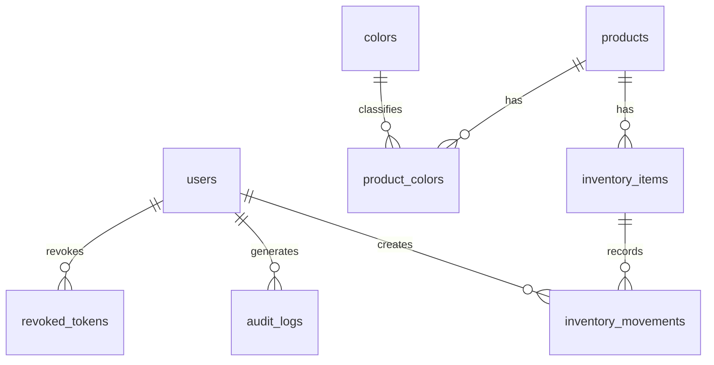

# Modelo de Datos Inicial

Este modelo incorpora las decisiones confirmadas por el usuario. Aun no debe implementarse hasta cerrar las preguntas tecnicas restantes marcadas al final.

## Entidades iniciales

### users

Usuarios autorizados para ingresar al sistema.

Campos base:

- `id`
- `username`
- `password_hash`
- `full_name`
- `role`
- `is_active`
- `created_at`
- `updated_at`
- `deleted_at`

Reglas confirmadas:

- El login sera con `username` y contrasena.
- No existira registro publico.
- El primer usuario se creara mediante script seed.
- Roles iniciales: `system_admin` y `admin`.
- `system_admin` tendra acceso total al sistema.
- `system_admin` podra entrar para mantenimiento, revision de problemas, soporte, nuevos modulos y futuras sedes.
- `admin` sera el administrador operativo de una sede.
- Cuando existan nuevas sedes o modulos, `admin` solo tendra acceso a lo que corresponda a su sede y permisos asignados.

### products

Referencia general del producto.

Campos base:

- `id`
- `name`
- `reference`
- `brand`
- `description`
- `photo_url`
- `current_purchase_price`
- `current_sale_price`
- `is_active`
- `cloudinary_public_id`
- `created_at`
- `updated_at`
- `deleted_at`

Reglas confirmadas:

- `reference` es unica.
- `brand` es obligatoria.
- `description` es obligatoria.
- `photo_url` es obligatoria.
- Se manejara precio de entrada y precio de venta al consumidor final.
- El precio de entrada y el precio de venta pertenecen a la referencia general.
- Si al ingresar nuevas unidades cambia el precio, el precio vigente de la referencia se actualizara automaticamente.
- Las fotos se almacenaran en Cloudinary usando su plan gratuito.
- El backend cargara las imagenes a Cloudinary.
- La base de datos guardara la URL de la imagen principal.
- `cloudinary_public_id` permitira gestionar futuras actualizaciones o eliminaciones logicas de imagenes.
- Cloudinary aportara persistencia, seguridad y optimizacion para web.

### colors

Catalogo controlado de colores.

Campos base:

- `id`
- `name`
- `is_active`
- `created_at`
- `updated_at`
- `deleted_at`

Valores iniciales:

- Negro.
- Blanco.
- Gris.
- Azul.
- Rojo.
- Verde.
- Beige.
- Cafe.
- Camel.
- Crema.
- Amarillo.
- Naranja.
- Rosado.
- Morado.
- Multicolor.
- Otro.

### product_colors

Relacion muchos a muchos entre productos y colores.

Campos base:

- `id`
- `product_id`
- `color_id`
- `created_at`
- `updated_at`
- `deleted_at`

### inventory_items

Existencia especifica por producto, talla, combinacion de colores y ubicacion.

Campos base:

- `id`
- `product_id`
- `size`
- `color_signature`
- `location_type`
- `location_detail`
- `quantity`
- `low_stock_alert`
- `created_at`
- `updated_at`
- `deleted_at`

Regla:

- La combinacion `product_id`, `size`, `color_signature`, `location_type` y `location_detail` debe representar una existencia unica.
- Si se registra una entrada con la misma referencia, talla, color y ubicacion, se suma la cantidad al registro existente.
- Solo se crea un nuevo registro cuando esa combinacion no existe.
- `size` sera numerica decimal en talla europea, por ejemplo `30` o `30.5`.
- `location_type` debe distinguir `WAREHOUSE` y `STORE`.
- `location_detail` sera texto libre para indicar ubicacion fisica, por ejemplo `A-01` o `Exhibicion`.
- Se permite cantidad `0`, pero debe mostrarse alerta de stock bajo.
- El umbral de stock bajo sera de 5 unidades.
- No se permiten cantidades negativas.
- La cantidad no podra modificarse directamente despues de registrada.
- Cualquier correccion de cantidad debe realizarse mediante movimiento de ajuste positivo o negativo.
- `color_signature` se generara automaticamente desde los colores seleccionados.
- `color_signature` no sera editable manualmente.
- Los colores se ordenaran y normalizaran internamente para evitar duplicados por orden distinto.
- Ejemplo: `Negro + Blanco` sera equivalente a `Blanco + Negro`.

### inventory_movements

Registro de entradas, salidas y ajustes de inventario.

Campos base:

- `id`
- `inventory_item_id`
- `movement_type`
- `quantity`
- `previous_quantity`
- `new_quantity`
- `purchase_unit_price`
- `sale_unit_price`
- `reason`
- `user_id`
- `created_at`
- `updated_at`
- `deleted_at`

Tipos preliminares:

- `IN`: entrada.
- `OUT`: salida.
- `ADJUSTMENT`: ajuste.

Reglas confirmadas:

- Las entradas registran precio de entrada y precio de venta vigente.
- Las salidas representan ventas.
- Se permiten ajustes manuales.
- Los ajustes pueden ser positivos o negativos.
- Los ajustes requieren motivo obligatorio.
- Los ajustes deben registrar fecha, usuario, cantidad anterior, cambio realizado y nueva cantidad.
- Los ajustes negativos no pueden dejar inventario por debajo de cero.
- Solo el administrador puede registrar entradas, salidas y ajustes.
- Las salidas deben guardar el precio de venta historico al momento de la venta.

### audit_logs

Auditoria de acciones importantes.

Campos base:

- `id`
- `user_id`
- `action`
- `entity_name`
- `entity_id`
- `ip_address`
- `metadata`
- `created_at`
- `updated_at`
- `deleted_at`

Acciones indicadas por el documento:

- Login.
- Logout.
- Entrada.
- Salida.
- Actualizacion.
- Eliminacion logica.

### revoked_tokens

Registro de Access Tokens invalidados antes de su expiracion natural.

Campos base:

- `id`
- `token_jti`
- `user_id`
- `revoked_at`
- `expires_at`
- `reason`
- `created_at`
- `updated_at`
- `deleted_at`

Reglas confirmadas:

- Al cerrar sesion, el token activo debe registrarse como revocado.
- Toda ruta protegida debe verificar que el token no este revocado.
- Los tokens revocados deben conservarse al menos hasta su fecha de expiracion.
- `token_jti` debe ser unico.

### clothing_products

Modulo futuro para ropa. No pertenece al primer modulo de inventario de calzado salvo confirmacion posterior.

Campos preliminares:

- `id`
- `reference`
- `category_id`
- `size_id`
- `gender_id`
- `description`
- `photo_url`
- `created_at`
- `updated_at`
- `deleted_at`

Regla:

- Categoria, talla y genero se manejaran mediante catalogos controlados.

## Relaciones

## Indices preliminares

- `users.username`
- Indice unico sobre `products.reference`
- `inventory_items.product_id`
- `inventory_items.size`
- `inventory_items.color_signature`
- `inventory_items.location_type`
- `inventory_items.location_detail`
- Indice unico sobre `inventory_items(product_id, size, color_signature, location_type, location_detail)`.
- `inventory_movements.inventory_item_id`
- `inventory_movements.user_id`
- `audit_logs.user_id`
- `audit_logs.action`
- `audit_logs.created_at`
- Indice unico sobre `revoked_tokens.token_jti`
- `revoked_tokens.user_id`
- `revoked_tokens.expires_at`

## Reglas de integridad

- `quantity` no debe ser negativa.
- Una salida no puede dejar inventario negativo.
- Un ajuste negativo no puede dejar inventario negativo.
- Una entrada sobre existencia repetida debe sumar cantidad y no duplicar registros.
- Las existencias con los mismos colores seleccionados en distinto orden deben considerarse la misma combinacion.
- Las cantidades no se editan directamente; se corrigen mediante movimientos de ajuste.
- Las eliminaciones deben ser logicas mediante `deleted_at`.
- Las operaciones importantes deben ejecutarse en transacciones.
- Toda modificacion de cantidad debe generar movimiento.
- Toda accion importante debe generar auditoria.
- Todo token revocado debe rechazarse aunque no haya expirado.
