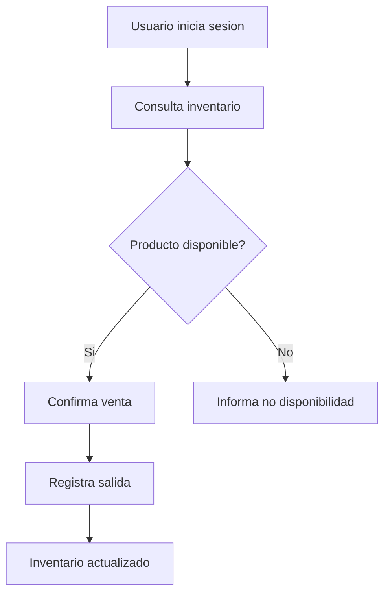

# Diseno Preliminar de Interfaz

La interfaz debe estar optimizada para uso diario del personal autorizado, con busqueda rapida y acciones claras.

## Usuarios iniciales

Roles iniciales:

- `system_admin`: acceso total.
- `admin`: administrador operativo de una sede.

No se crearan roles de vendedor ni bodega en la primera version.

Regla de permisos:

- `system_admin` podra acceder al sistema completo para mantenimiento, soporte, problemas tecnicos, nuevos modulos y futuras sedes.
- `admin` solo tendra acceso operativo a su sede y a los modulos asignados.

## Pantallas iniciales

### Login

Objetivo:

- Permitir el acceso de usuarios autorizados.

Campos:

- Username.
- Contrasena.

Acciones:

- Iniciar sesion.

No debe existir registro publico.

Estado implementado:

- Pantalla React con diseno visual inicial.
- Login conectado a `POST /api/v1/auth/login`.
- Guarda Access Token en `localStorage`.
- Redirige al panel de inventario al iniciar sesion.

### Inventario

Objetivo:

- Consultar disponibilidad de referencias, tallas, colores, ubicaciones y cantidades.

Elementos:

- Buscador por referencia o nombre.
- Buscador por descripcion.
- Filtros por talla, color, bodega, tienda y ubicacion.
- Tabla de resultados.
- Indicador de cantidad disponible.
- Alerta de stock bajo.
- Acciones de entrada y salida.
- Accion para ver historial de movimientos.

Estado implementado:

- Dashboard con cards de existencias.
- Resumen de unidades totales, stock bajo, bodega y tienda.
- Muestra foto, referencia, marca, cantidad, talla, colores, ubicacion y precios.
- Acciones por existencia: entrada, salida, ajuste e historial.

Columnas preliminares:

- Referencia.
- Producto.
- Talla.
- Color.
- Tipo de ubicacion.
- Detalle de ubicacion.
- Cantidad.
- Precio de entrada.
- Precio de venta.
- Estado.
- Acciones.

### Registro de entrada

Objetivo:

- Registrar ingreso de nueva mercancia.

Campos preliminares:

- Producto o referencia.
- Talla.
- Color o combinacion de colores.
- Tipo de ubicacion: bodega o tienda.
- Detalle de ubicacion.
- Cantidad.
- Precio de entrada.
- Precio de venta al consumidor final.
- Motivo.

Reglas:

- Si la referencia no existe, el administrador podra crearla con marca, descripcion y foto.
- Si la misma referencia, talla, color y ubicacion ya existe, el sistema sumara unidades.
- Si el precio cambio, el administrador podra registrar los nuevos precios.
- Al registrar nuevos precios, el sistema actualizara automaticamente los precios vigentes de la referencia.
- El campo de colores generara internamente una combinacion normalizada para evitar duplicados por orden de seleccion.

Estado implementado:

- Modal conectado a `POST /api/v1/inventory/entries`.
- Usa catalogo controlado de colores desde `/api/v1/catalogs/colors`.
- Usa referencias existentes desde `/api/v1/products`.
- Permite actualizar precios al registrar una entrada.

### Registro de salida

Objetivo:

- Descontar unidades una vez realizada una venta u otra salida confirmada.

Campos preliminares:

- Cantidad.
- Motivo.

Reglas visibles:

- No permitir cantidades menores o iguales a cero.
- No permitir salida mayor a la disponibilidad actual.
- Mostrar que toda salida se registra como venta.

Estado implementado:

- Modal conectado a `POST /api/v1/inventory/{inventory_item_id}/exits`.

### Ajuste de inventario

Objetivo:

- Corregir errores de inventario sin editar cantidades directamente.

Campos:

- Cantidad de ajuste positiva o negativa.
- Motivo obligatorio.

Reglas visibles:

- No permitir ajuste en `0`.
- No permitir que un ajuste negativo deje cantidad menor que `0`.
- Registrar automaticamente fecha, usuario y cambio realizado.

Estado implementado:

- Modal conectado a `POST /api/v1/inventory/{inventory_item_id}/adjustments`.

### Auditoria

Objetivo:

- Consultar acciones importantes.

Regla:

- La auditoria sera visible desde la interfaz para usuarios autorizados.

### Historial de movimientos

Objetivo:

- Consultar entradas, salidas y ajustes por producto o existencia.

Columnas preliminares:

- Fecha.
- Usuario.
- Tipo de movimiento.
- Cantidad anterior.
- Cantidad del movimiento.
- Cantidad nueva.
- Precio de entrada.
- Precio de venta.
- Motivo.

Estado implementado:

- Modal conectado a `GET /api/v1/inventory/{inventory_item_id}/movements`.
- Muestra tipo, motivo, delta, cantidad anterior, cantidad nueva, fecha y usuario.

### Catalogos

Objetivo:

- Gestionar opciones controladas usadas por formularios.

Catalogos iniciales:

- Colores.
- Tipos de ubicacion.

Colores iniciales:

- Negro.
- Blanco.
- Gris.
- Azul.
- Rojo.
- Verde.
- Beige.
- Cafe.
- Camel.
- Crema.
- Amarillo.
- Naranja.
- Rosado.
- Morado.
- Multicolor.
- Otro.

## Flujo principal

## Componentes reutilizables

- Layout autenticado.
- Barra superior.
- Menu lateral o navegacion principal.
- Tabla de datos.
- Campo de busqueda.
- Filtros.
- Selector de color multiple.
- Modal de entrada.
- Modal de salida.
- Modal de ajuste.
- Vista de historial.
- Alertas.
- Estados de carga.
- Estados vacios.
- Componente de error.

Componentes implementados:

- `Layout`.
- `Modal`.
- `ProductForm`.
- `InventoryEntryForm`.
- `InventoryExitForm`.
- `InventoryAdjustmentForm`.
- `InventoryMovements`.

## Validaciones frontend

- Campos obligatorios.
- Cantidad numerica mayor que cero.
- Cantidad de salida menor o igual al stock disponible.
- Talla numerica decimal en escala europea.
- Username obligatorio.
- Foto obligatoria al crear referencia.
- Las fotos se cargaran mediante el backend a Cloudinary.
- La interfaz usara la URL de Cloudinary retornada por la API.
- Marca y descripcion obligatorias.
- Precio de entrada y precio de venta obligatorios.

## Criterios UX

- La busqueda de inventario debe ser rapida.
- La informacion clave debe verse sin navegar por varias pantallas.
- Las acciones de entrada y salida deben pedir confirmacion.
- Los mensajes deben ser claros para uso operativo.
