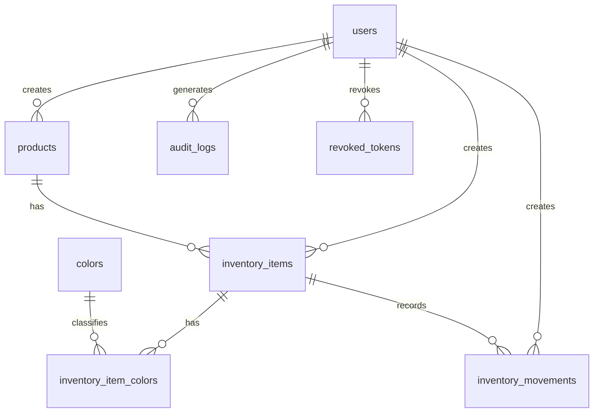

# Diseno Definitivo de Base de Datos - Modulo de Calzado

Este documento define el esquema definitivo para implementar el modulo inicial de inventario de calzado en Neon PostgreSQL.

## Convenciones

- Motor: PostgreSQL en Neon.
- ORM: SQLAlchemy 2.
- Migraciones: Alembic.
- Identificadores: `UUID`.
- Generacion de UUID: `gen_random_uuid()`.
- Fechas: `TIMESTAMPTZ`.
- Soft delete: todas las tablas principales incluyen `deleted_at`.
- Moneda: valores enteros en pesos, sin decimales.
- Respuestas historicas: los movimientos guardan precios y cantidades del momento de la accion.

## Extensiones

```sql
CREATE EXTENSION IF NOT EXISTS pgcrypto;
```

## Enums

### user_role

Valores:

- `system_admin`
- `admin`

Reglas:

- `system_admin` tiene acceso total para soporte, mantenimiento, problemas tecnicos, nuevos modulos y futuras sedes.
- `admin` es administrador operativo de una sede.

### location_type

Valores:

- `WAREHOUSE`
- `STORE`

Reglas:

- `WAREHOUSE` representa bodega.
- `STORE` representa tienda o punto fisico.

### movement_type

Valores:

- `IN`
- `OUT`
- `ADJUSTMENT`

Reglas:

- `IN`: entrada de unidades.
- `OUT`: salida por venta.
- `ADJUSTMENT`: correccion manual positiva o negativa.

### audit_action

Valores iniciales:

- `LOGIN`
- `LOGOUT`
- `CREATE`
- `UPDATE`
- `DELETE`
- `INVENTORY_IN`
- `INVENTORY_OUT`
- `INVENTORY_ADJUSTMENT`
- `TOKEN_REVOKED`

## Campos comunes

Todas las tablas principales tendran:

- `id UUID PRIMARY KEY DEFAULT gen_random_uuid()`
- `created_at TIMESTAMPTZ NOT NULL DEFAULT now()`
- `updated_at TIMESTAMPTZ NOT NULL DEFAULT now()`
- `deleted_at TIMESTAMPTZ NULL`

La actualizacion automatica de `updated_at` se implementara desde SQLAlchemy o mediante evento de aplicacion.

## Tablas

### users

Usuarios autorizados del sistema.

Campos:

- `id UUID PRIMARY KEY DEFAULT gen_random_uuid()`
- `username VARCHAR(80) NOT NULL`
- `password_hash VARCHAR(255) NOT NULL`
- `full_name VARCHAR(150) NOT NULL`
- `role user_role NOT NULL`
- `is_active BOOLEAN NOT NULL DEFAULT true`
- `created_at TIMESTAMPTZ NOT NULL DEFAULT now()`
- `updated_at TIMESTAMPTZ NOT NULL DEFAULT now()`
- `deleted_at TIMESTAMPTZ NULL`

Restricciones:

- `username` unico entre usuarios no eliminados.
- No existe registro publico.
- El primer usuario se crea por seed.

Indices:

```sql
CREATE UNIQUE INDEX ux_users_username_active
ON users (lower(username))
WHERE deleted_at IS NULL;
```

### colors

Catalogo controlado de colores.

Campos:

- `id UUID PRIMARY KEY DEFAULT gen_random_uuid()`
- `name VARCHAR(50) NOT NULL`
- `normalized_name VARCHAR(50) NOT NULL`
- `is_active BOOLEAN NOT NULL DEFAULT true`
- `created_at TIMESTAMPTZ NOT NULL DEFAULT now()`
- `updated_at TIMESTAMPTZ NOT NULL DEFAULT now()`
- `deleted_at TIMESTAMPTZ NULL`

Restricciones:

- `normalized_name` unico entre colores no eliminados.

Valores seed:

- Negro.
- Blanco.
- Gris.
- Azul.
- Rojo.
- Verde.
- Beige.
- Cafe.
- Camel.
- Crema.
- Amarillo.
- Naranja.
- Rosado.
- Morado.
- Multicolor.
- Otro.

Indices:

```sql
CREATE UNIQUE INDEX ux_colors_normalized_name_active
ON colors (normalized_name)
WHERE deleted_at IS NULL;
```

### products

Referencia general del calzado.

Campos:

- `id UUID PRIMARY KEY DEFAULT gen_random_uuid()`
- `reference VARCHAR(80) NOT NULL`
- `name VARCHAR(150) NOT NULL`
- `brand VARCHAR(100) NOT NULL`
- `description TEXT NOT NULL`
- `photo_url TEXT NOT NULL`
- `cloudinary_public_id VARCHAR(255) NULL`
- `current_purchase_price INTEGER NOT NULL`
- `current_sale_price INTEGER NOT NULL`
- `is_active BOOLEAN NOT NULL DEFAULT true`
- `created_by UUID NULL REFERENCES users(id)`
- `updated_by UUID NULL REFERENCES users(id)`
- `created_at TIMESTAMPTZ NOT NULL DEFAULT now()`
- `updated_at TIMESTAMPTZ NOT NULL DEFAULT now()`
- `deleted_at TIMESTAMPTZ NULL`

Restricciones:

- `reference` unico entre productos no eliminados.
- `current_purchase_price >= 0`.
- `current_sale_price >= 0`.
- `photo_url` guarda la URL de Cloudinary.
- Los precios vigentes pertenecen a la referencia general.
- Si una entrada registra precios nuevos, estos campos se actualizan automaticamente.

Indices:

```sql
CREATE UNIQUE INDEX ux_products_reference_active
ON products (upper(reference))
WHERE deleted_at IS NULL;

CREATE INDEX ix_products_search
ON products (upper(reference), lower(name));
```

### inventory_items

Existencia especifica por referencia, talla, combinacion de colores y ubicacion.

Campos:

- `id UUID PRIMARY KEY DEFAULT gen_random_uuid()`
- `product_id UUID NOT NULL REFERENCES products(id)`
- `size NUMERIC(4,1) NOT NULL`
- `color_signature VARCHAR(255) NOT NULL`
- `location_type location_type NOT NULL`
- `location_detail VARCHAR(150) NOT NULL`
- `quantity INTEGER NOT NULL DEFAULT 0`
- `low_stock_threshold INTEGER NOT NULL DEFAULT 5`
- `is_active BOOLEAN NOT NULL DEFAULT true`
- `created_by UUID NULL REFERENCES users(id)`
- `updated_by UUID NULL REFERENCES users(id)`
- `created_at TIMESTAMPTZ NOT NULL DEFAULT now()`
- `updated_at TIMESTAMPTZ NOT NULL DEFAULT now()`
- `deleted_at TIMESTAMPTZ NULL`

Restricciones:

- `size > 0`.
- `quantity >= 0`.
- `low_stock_threshold >= 0`.
- La talla se maneja como numerica decimal en escala europea.
- `color_signature` se genera automaticamente desde los colores seleccionados.
- `color_signature` no se edita manualmente.
- `location_detail` es texto libre.
- La cantidad no puede editarse directamente desde formularios; solo por movimientos.

Indice unico:

```sql
CREATE UNIQUE INDEX ux_inventory_items_unique_active
ON inventory_items (
  product_id,
  size,
  color_signature,
  location_type,
  lower(location_detail)
)
WHERE deleted_at IS NULL;
```

Indices de consulta:

```sql
CREATE INDEX ix_inventory_items_product
ON inventory_items (product_id)
WHERE deleted_at IS NULL;

CREATE INDEX ix_inventory_items_filters
ON inventory_items (size, location_type, quantity)
WHERE deleted_at IS NULL;

CREATE INDEX ix_inventory_items_low_stock
ON inventory_items (quantity, low_stock_threshold)
WHERE deleted_at IS NULL;
```

### inventory_item_colors

Relacion entre una existencia y los colores que forman su combinacion.

Campos:

- `id UUID PRIMARY KEY DEFAULT gen_random_uuid()`
- `inventory_item_id UUID NOT NULL REFERENCES inventory_items(id)`
- `color_id UUID NOT NULL REFERENCES colors(id)`
- `sort_order SMALLINT NOT NULL DEFAULT 0`
- `created_at TIMESTAMPTZ NOT NULL DEFAULT now()`
- `updated_at TIMESTAMPTZ NOT NULL DEFAULT now()`
- `deleted_at TIMESTAMPTZ NULL`

Restricciones:

- No se repite el mismo color dentro de la misma existencia activa.
- La aplicacion ordena los colores por `normalized_name` antes de generar `color_signature`.

Indices:

```sql
CREATE UNIQUE INDEX ux_inventory_item_colors_active
ON inventory_item_colors (inventory_item_id, color_id)
WHERE deleted_at IS NULL;

CREATE INDEX ix_inventory_item_colors_color
ON inventory_item_colors (color_id)
WHERE deleted_at IS NULL;
```

### inventory_movements

Historial de entradas, salidas y ajustes.

Campos:

- `id UUID PRIMARY KEY DEFAULT gen_random_uuid()`
- `inventory_item_id UUID NOT NULL REFERENCES inventory_items(id)`
- `movement_type movement_type NOT NULL`
- `quantity_delta INTEGER NOT NULL`
- `previous_quantity INTEGER NOT NULL`
- `new_quantity INTEGER NOT NULL`
- `purchase_unit_price INTEGER NULL`
- `sale_unit_price INTEGER NULL`
- `reason TEXT NOT NULL`
- `user_id UUID NOT NULL REFERENCES users(id)`
- `created_at TIMESTAMPTZ NOT NULL DEFAULT now()`
- `updated_at TIMESTAMPTZ NOT NULL DEFAULT now()`
- `deleted_at TIMESTAMPTZ NULL`

Restricciones:

- `quantity_delta <> 0`.
- `previous_quantity >= 0`.
- `new_quantity >= 0`.
- `purchase_unit_price IS NULL OR purchase_unit_price >= 0`.
- `sale_unit_price IS NULL OR sale_unit_price >= 0`.
- Para `IN`, `quantity_delta > 0`.
- Para `OUT`, `quantity_delta < 0`.
- Para `ADJUSTMENT`, `quantity_delta` puede ser positivo o negativo, pero no cero.
- Toda salida representa una venta.
- Toda salida guarda precio de venta historico.
- Todo ajuste requiere motivo.

Indices:

```sql
CREATE INDEX ix_inventory_movements_item_created
ON inventory_movements (inventory_item_id, created_at DESC)
WHERE deleted_at IS NULL;

CREATE INDEX ix_inventory_movements_user_created
ON inventory_movements (user_id, created_at DESC)
WHERE deleted_at IS NULL;

CREATE INDEX ix_inventory_movements_type_created
ON inventory_movements (movement_type, created_at DESC)
WHERE deleted_at IS NULL;
```

### audit_logs

Auditoria de acciones importantes.

Campos:

- `id UUID PRIMARY KEY DEFAULT gen_random_uuid()`
- `user_id UUID NULL REFERENCES users(id)`
- `action audit_action NOT NULL`
- `entity_name VARCHAR(80) NULL`
- `entity_id UUID NULL`
- `ip_address INET NULL`
- `metadata JSONB NULL`
- `created_at TIMESTAMPTZ NOT NULL DEFAULT now()`
- `updated_at TIMESTAMPTZ NOT NULL DEFAULT now()`
- `deleted_at TIMESTAMPTZ NULL`

Reglas:

- Login, logout, entradas, salidas, ajustes, actualizaciones y eliminaciones logicas generan auditoria.
- La auditoria sera visible en la interfaz para usuarios autorizados.

Indices:

```sql
CREATE INDEX ix_audit_logs_user_created
ON audit_logs (user_id, created_at DESC);

CREATE INDEX ix_audit_logs_action_created
ON audit_logs (action, created_at DESC);

CREATE INDEX ix_audit_logs_entity
ON audit_logs (entity_name, entity_id);
```

### revoked_tokens

Tokens JWT invalidados antes de expirar.

Campos:

- `id UUID PRIMARY KEY DEFAULT gen_random_uuid()`
- `token_jti VARCHAR(120) NOT NULL`
- `user_id UUID NOT NULL REFERENCES users(id)`
- `revoked_at TIMESTAMPTZ NOT NULL DEFAULT now()`
- `expires_at TIMESTAMPTZ NOT NULL`
- `reason VARCHAR(120) NOT NULL DEFAULT 'logout'`
- `created_at TIMESTAMPTZ NOT NULL DEFAULT now()`
- `updated_at TIMESTAMPTZ NOT NULL DEFAULT now()`
- `deleted_at TIMESTAMPTZ NULL`

Restricciones:

- `token_jti` unico.
- Toda ruta protegida rechaza tokens cuyo `jti` este revocado.
- Los tokens revocados deben mantenerse al menos hasta `expires_at`.

Indices:

```sql
CREATE UNIQUE INDEX ux_revoked_tokens_jti
ON revoked_tokens (token_jti);

CREATE INDEX ix_revoked_tokens_user
ON revoked_tokens (user_id);

CREATE INDEX ix_revoked_tokens_expires_at
ON revoked_tokens (expires_at);
```

## Relaciones



## Reglas Transaccionales

### Entrada de inventario

1. Buscar producto por `reference`.
2. Si no existe, crear producto con datos obligatorios y URL de Cloudinary.
3. Normalizar colores seleccionados.
4. Generar `color_signature`.
5. Buscar existencia por `product_id`, `size`, `color_signature`, `location_type` y `location_detail`.
6. Si existe, sumar `quantity`.
7. Si no existe, crear existencia.
8. Si los precios cambiaron, actualizar precios vigentes del producto.
9. Crear movimiento `IN`.
10. Crear auditoria `INVENTORY_IN`.

Todo debe ocurrir en una sola transaccion.

### Salida de inventario

1. Validar que `quantity` solicitada sea mayor que cero.
2. Validar que la existencia tenga unidades suficientes.
3. Restar unidades.
4. Crear movimiento `OUT` con `quantity_delta` negativo.
5. Guardar precio de venta historico.
6. Crear auditoria `INVENTORY_OUT`.

Todo debe ocurrir en una sola transaccion.

### Ajuste de inventario

1. Validar que `quantity_delta` no sea cero.
2. Validar que el resultado no deje cantidad negativa.
3. Aplicar ajuste.
4. Crear movimiento `ADJUSTMENT`.
5. Crear auditoria `INVENTORY_ADJUSTMENT`.

Todo ajuste requiere motivo obligatorio.

### Logout

1. Registrar auditoria `LOGOUT`.
2. Guardar `jti` en `revoked_tokens`.
3. Rechazar ese token en futuras rutas protegidas aunque no haya expirado.

## Seeds Iniciales

### Colores

Crear los colores definidos en `colors` con `normalized_name` en minuscula y sin espacios innecesarios.

### Usuario system_admin

Crear el primer usuario mediante script seed.

Variables previstas:

- `SYSTEM_ADMIN_USERNAME`
- `SYSTEM_ADMIN_PASSWORD`
- `SYSTEM_ADMIN_FULL_NAME`

Reglas:

- La contrasena se almacena con BCrypt.
- No se imprime la contrasena en logs.
- Si el usuario ya existe, el seed no debe duplicarlo.

## Decisiones Fuera del Modulo Inicial

- Ropa queda contemplado como modulo futuro.
- No se crean tablas de ropa en la primera migracion.
- No se implementan multiples sedes en la primera version, pero `system_admin` queda preparado para ese crecimiento.
- No se implementan exportaciones Excel/PDF en la primera version.
